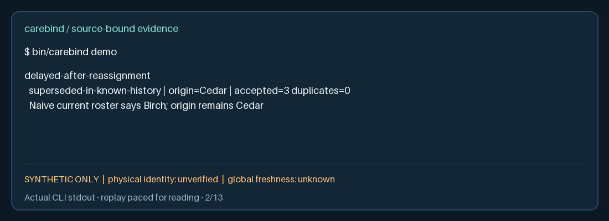
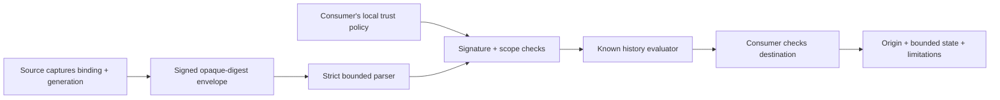
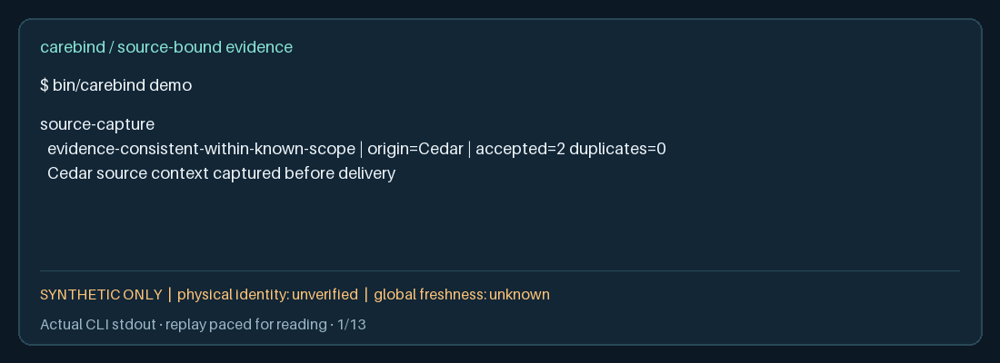

<p align="left"></p>

**The channel changes. The original association does not.**

CareBind preserves the source context of delayed observations when a device channel
is reassigned. It exposes conflicting histories and missing evidence instead of
silently attaching old information to a new encounter.

A small Go library and offline CLI for integration engineers, with signed evidence,
explicit local trust, and a reproducible synthetic conformance demo. No server,
model API, clinical payload or global identity registry is required.

**Unreleased technical candidate.** Physical identity is always **unverified**;
global freshness is always **unknown**. This is not clinical decision software.
See the [gate status](docs/verification/status.md) before relying on any release claim.



[Quickstart](#quickstart) · [Architecture](docs/architecture/README.md) ·
[Protocol](docs/architecture/protocol.md) · [Security](SECURITY.md) ·
[Verification](docs/verification/README.md) · [Contributing](CONTRIBUTING.md)

## Quickstart

Requires Go **1.27.1**, Git, Python **3.9+**, and OpenSSL **3+** for the independent
conformance check. The runtime has no third-party Go module dependencies.
From the repository root:

```sh
go build -trimpath -o bin/carebind ./cmd/carebind
bin/carebind demo
go test ./...
```

The demo executes thirteen assertions, including Cedar → delayed observation →
Birch reassignment, partition conflicts, unknown issuers, tampering, replay, revoked
keys, stripped context, a synthetic item and the wrong-tag blind spot.

Exercise the separate receiving adapter:

```sh
bin/carebind fixture cross-site-link > /tmp/carebind-bundle.json
bin/carebind demo-policy > /tmp/carebind-policy.json
bin/carebind evaluate /tmp/carebind-bundle.json /tmp/carebind-policy.json
python3 examples/receiver/receive.py ./bin/carebind /tmp/carebind-bundle.json /tmp/carebind-policy.json 42
python3 scripts/verify.py
```

The receiver stores numeric slot `42` while preserving origin `field:Cedar` and its
binding digest. Substitute slot `43` to see an explicit conflict. The demo policy
and keys are **public synthetic fixtures**, unsuitable for operational use.
Provide a separately trusted local policy; never accept policy supplied by a sender.

## Follow the evidence



| What arrives | What CareBind reports |
|---|---|
| Cedar observation after channel reassigned to Birch | Cedar origin; superseded in known history |
| Two accepted bindings for one generation | Conflicting |
| Missing source binding or scoped link | Unbound |
| Tampered observation or unaccepted issuer | Evidence-invalid |
| Stale local policy or incomplete chain | Unknown-stale |
| Consistent evidence on the wrong physical prop | Digitally consistent; physical identity **unverified** |

Every decision is relative to supplied evidence and policy. An unseen conflicting
branch cannot be detected. A signature establishes bytes and a key, not the truth
of a physical association. Outputs never direct denial of human care.

## Watch and reproduce

<details><summary>Actual software demo replay — thirteen hard cases</summary>



</details>

The [text transcript](docs/assets/demo.txt), [terminal capture](docs/assets/demo.cast)
and [recording provenance](docs/assets/recording.json) come from running the CLI.
The PNG/GIF render that stdout; replay timing is paced for readability. They are
not desktop screenshots or a real medical-device/physical trial.
[Re-recording instructions](docs/demo.md) include the exact command and limitations.

## Why another association tool?

IHE PCIM, FHIR DeviceAssociation, SDC context and provenance standards already cover
important parts of this problem. CareBind contributes an inspectable, bounded
history evaluator and adversarial cross-adapter contract. It implements no FHIR,
PCIM or SDC transport and claims no standards certification or global novelty.
Read the [primary-source comparison](docs/research-landscape.md).

## Evidence before claims

The [frozen constitution](docs/engineering/constitution.md) predates source code.
Checks cover generated histories, merge laws, strict parsing, signature controls,
reference interpretation, real process adapters and clean-clone use. A same-author
reference is not an independent human audit. Synthetic tests establish neither
clinical benefit nor readiness for deployment in care.

Local platform: macOS arm64. Linux/macOS hosted checks are configured; supported
platform and production-readiness claims require completed evidence listed in the
[verification status](docs/verification/status.md). Windows is not claimed.

[Public API](docs/api.md) · [Threat model](docs/threat-model/README.md) ·
[Release process](docs/releasing.md) · [AI-assisted engineering](docs/engineering/ai-assisted-engineering.md) ·
[AGENTS.md](AGENTS.md) · [Governance](GOVERNANCE.md) · [Roadmap](ROADMAP.md)

Created and maintained by [Nima Khaki](https://github.com/Nima0101).
[MIT license](LICENSE); [third-party notices](docs/third-party-licenses.md).
